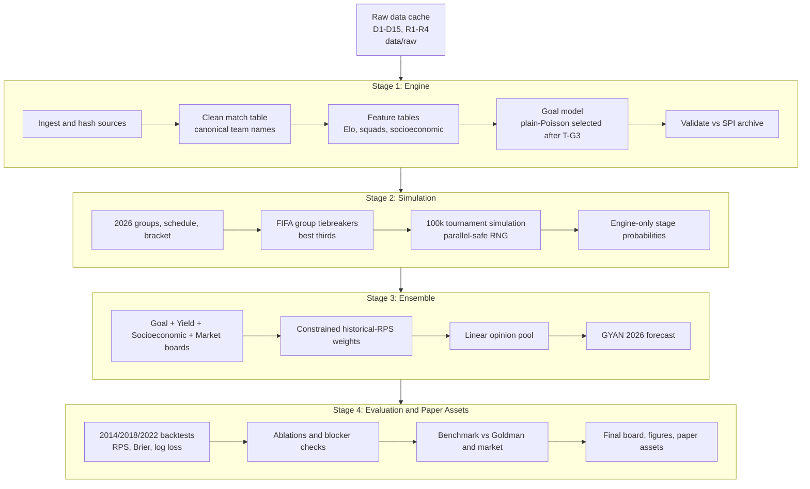

# GYAN World Cup Model

GYAN is a reproducible Python forecasting pipeline for the 2026 FIFA World Cup.
It combines four expert signals into a tournament probability board:

- **Goal expert:** an Elo-anchored international goal model, currently shipping
  the validated plain-Poisson fallback after Dixon-Coles tuning did not beat the
  same-decay plain-Poisson baseline. The shipped score matrix keeps those plain
  Poisson means but uses a draw-calibrated correlated negative-binomial
  distribution.
- **Yield expert:** named-squad value signal using the actual 2026 squad lists,
  Transfermarkt player values, UEFA-value discounting, age weighting, and
  injury/absence adjustments.
- **Socioeconomic expert:** a Hoffmann/Klement-style macro and FIFA-points prior.
- **Market expert:** de-vigged live 2026 outright probabilities from prediction
  markets and bookmaker sources, with historical bookmaker outrights for
  backtests.

The shipped 2026 model is a constrained four-expert linear opinion pool fit by
historical RPS, then wrapped around a 48-team tournament simulation and evaluated
against 2014, 2018, and 2022 World Cup backtests.

## Current Status

All four build stages are implemented and verified. The current latest Stage 4
artifacts are based on the June 9, 2026 development snapshot:

- Final board: `outputs/tables/gyan_2026_predictions_20260609_022619.csv`
- Stage 4 run record: `outputs/reports/run_stage4_evaluation_20260609_022621.json`
- Stage 4 summary: `outputs/reports/stage4_summary.md`
- Stage 4 validation: `outputs/reports/stage4_output_validation_20260609_022619.json`
- Paper draft: `paper/manuscript.md`
- Reproducibility appendix: `paper/reproducibility.md`

Current shipped weights:

| Expert | Weight |
|---|---:|
| Goal | 0.050 |
| Yield named | 0.050 |
| Socioeconomic | 0.244 |
| Market | 0.656 |

Current top 10 champion probabilities:

| Team | Champion probability |
|---|---:|
| Spain | 13.02% |
| France | 11.33% |
| England | 9.17% |
| Argentina | 8.50% |
| Brazil | 7.57% |
| Portugal | 7.51% |
| Germany | 5.08% |
| Netherlands | 3.71% |
| Morocco | 2.01% |
| Mexico | 1.92% |

The final pre-opening snapshot is planned for:

```text
2026-06-10T19:00:00Z
14:00 America/Chicago
```

That snapshot should refresh squads, injuries, Transfermarkt values, recent
matches/Elo, Polymarket, Kalshi, and bookmaker sources, then rerun Stage 3 and
Stage 4. Final records should state that no inputs after
`2026-06-10T19:00:00Z` were used.

The freeze is also a squad-window limitation. It locks squads and injuries for
teams playing June 11 and June 12, but teams whose first match is June 13 or
later can still make permitted replacement changes inside their own 24-hour
pre-match window. Treat post-freeze squad/injury changes as an unavoidable
limitation, not a reproducibility failure.

Before that run, commit and tag the repository at `gyan-v1.0-final` so final run
records contain both a real git commit and a named release tag. The final paper's
reproducibility claim depends on the git hash/tag, input SHA-256 hashes, and
`GLOBAL_SEED` appearing together in the run records.

Do not lock the paper interpretation to the current board. The current top
probability is Spain at about 13.03%, and the Market expert still dominates the
pool at 65.6%. That weight was earned on historical bookmaker outrights, while
the live 2026 Market expert is a Polymarket/Kalshi/bookmaker blend. During the
Wednesday, 2026-06-10 final run, compare the refreshed live blended market vector
against the pre-refresh proxy in
`outputs/tables/market_source_divergence_latest.csv`; the live pull can still
move the top six meaningfully. Do not re-fit weights on 2026 because outcomes are
unknown. If the top-six movement is large, keep the weights fixed but state in
the paper limitations that the market weight transfers across a slightly
different source mix.

## Architecture



## Repository Layout

```text
gyan-wc-model/
├── PRD/                         # stage requirements and decision log
├── data/
│   ├── raw/                     # downloaded/cached source data
│   ├── interim/                 # cleaned intermediate data
│   └── processed/               # model-ready feature tables
├── src/gyan/                    # installable package
│   ├── config.py                # paths, seeds, constants
│   ├── data/                    # ingestion and cleaning
│   ├── features/                # Elo, squad value, socioeconomic features
│   ├── engine/                  # goal model
│   ├── simulation/              # tournament simulator
│   ├── ensemble/                # experts, markets, pooling
│   ├── evaluation/              # scoring, backtests, benchmarks
│   └── utils/                   # logging and RNG helpers
├── scripts/                     # stage entry points
├── tests/                       # pytest tests
├── outputs/
│   ├── tables/                  # CSV/parquet outputs
│   ├── figures/                 # PNG/PDF figures and captions
│   └── reports/                 # run records and summaries
├── paper/                       # manuscript draft and paper figures
├── pyproject.toml
├── requirements.txt
└── README.md
```

## Environment

The project targets macOS / Apple Silicon, but the code is standard Python and
should run anywhere the pinned dependencies install.

- Python: 3.12 or newer
- Environment manager: `uv` preferred, otherwise `python -m venv .venv`
- Core runtime: NumPy, pandas, pyarrow, scipy, statsmodels, joblib
- Goal-model support: `penaltyblog`, with custom model code where project-specific
  international handling was required
- Scraping/API cache: httpx, beautifulsoup4, lxml
- Plotting: matplotlib, seaborn
- Tests: pytest, pytest-cov
- Logging: standard logging plus python-json-logger

Pinned package versions live in `requirements.txt`. Keep `numpy` and `numba`
compatible; the project currently assumes the pinned stack rather than floating
latest releases.

## Setup

```bash
uv venv
uv pip install -r requirements.txt
.venv/bin/python -m pytest
```

If `uv` is not available:

```bash
python3 -m venv .venv
.venv/bin/pip install -r requirements.txt
.venv/bin/python -m pytest
```

## Run Order

The pipeline is organized by stage. Run records are written to
`outputs/reports/`, logs to `logs/`, tables to `outputs/tables/`, and figures to
`outputs/figures/`.

```bash
.venv/bin/python scripts/s1_download_data.py
.venv/bin/python scripts/s1_clean_matches.py
.venv/bin/python scripts/s1_build_elo.py
.venv/bin/python scripts/s1_build_socioeconomic.py
.venv/bin/python scripts/s1_build_squad_value.py
.venv/bin/python scripts/s1_fit_dixon_coles.py
.venv/bin/python scripts/s1_validate_engine.py

.venv/bin/python scripts/s2_build_structure.py
.venv/bin/python scripts/s2_run_simulation.py

.venv/bin/python scripts/s3_build_ensemble.py
.venv/bin/python scripts/s4_backtest.py
```

The final pre-opening production run should be performed after refreshing live
inputs at `2026-06-10T19:00:00Z`.

## Stage Summary

### Stage 1: Engine

Stage 1 ingests, hashes, cleans, and feature-engineers the source data.

Current implementation notes:

- Canonical match table: `data/interim/matches_clean.parquet`
- Elo feature table: `data/processed/matches_with_elo.parquet`
- Squad features: `data/processed/squad_features_2026.parquet`
- Socioeconomic features: `data/processed/socioeconomic_features.parquet`
- Goal parameters: `data/processed/dixon_coles_params_latest.json`
- Engine validation: `outputs/tables/engine_validation_latest.csv`
- Draw calibration: `outputs/tables/engine_draw_calibration_latest.csv`

T-G3 was actioned: Dixon-Coles tuning did not improve held-out RPS versus the
plain-Poisson candidate, so the shipped goal engine uses `selected_engine:
plain_poisson` with `score_distribution: correlated_negative_binomial`.

### Stage 2: Simulation

Stage 2 encodes the 48-team tournament, FIFA group tiebreakers, best-third-place
selection, Round-of-32 bracket assignment, knockout progression, extra time, and
penalty shootout resolution.

Current implementation notes:

- Groups: `data/processed/groups_2026.parquet`
- Schedule: `data/processed/schedule_2026.parquet`
- Bracket pairings: `data/processed/bracket_pairings_2026.json`
- Engine-only board: `outputs/tables/team_advancement_probs_engineonly_2026_latest.csv`
- Convergence figure: `outputs/figures/mc_convergence.pdf`

Latest verified Stage 2 checks:

- 100,000 simulations
- Deterministic same-worker run: pass
- Seed-stable across worker counts: pass
- Champion probabilities sum to 1
- Stage probabilities are monotone
- Knockout upset rate around 0.355, so T-G6 did not trip
- Group-stage draw rate around 0.246; knockout penalty rate around 0.163

### Stage 3: Ensemble

Stage 3 builds tournament boards for the four experts and combines them into the
GYAN forecast.

Current shipped pool:

- Pool: linear opinion pool
- Fit: constrained historical RPS over 2014, 2018, and 2022 World Cup matches
- Minimum shipped expert weight: 0.05
- Weights: Goal 0.050, Yield named 0.050, Socioeconomic 0.244, Market 0.656
- Floor framing: the 0.05 minimum expert weight is a deliberate implementation
  addition beyond the original PRD optimization spec. It keeps all four experts
  represented for structure and interpretability, but the current unconstrained
  linear fit would put Goal at 0.000 and Yield named at about 0.012. The
  constrained floor therefore binds for Goal/Yield and costs about 0.000184
  in-sample RPS versus the unconstrained selected-pool optimum.
- Leave-one-tournament-out guard: the 0.195714 optimized RPS is in-sample on the
  same 192 matches used to fit the weights. Rotating the historical fit by held-
  out tournament gives optimized RPS 0.198501 versus equal-weight RPS 0.202661,
  so the optimized 5/5/24/66 split currently survives the out-of-sample guard.
- Match-objective framing: historical weights are fit on match-level mean RPS
  over 192 matches; in the 2014/2018/2022 32-team format, 144 of those matches
  are group-stage games and 48 are knockouts. The weights are then applied to a
  2026 tournament/champion board with knockout and bracket-path sensitivity, so
  high Market/strength weight can partly reflect group-stage-heavy calibration.
- Yield framing: the named-squad/injury Yield expert is novel in design, but its
  shipped 5% weight is the positive-weight floor in the current constrained fit.
  Use the Y-named versus Y-nominal ablation to support marginal benefit, and
  frame the novelty as methodological rather than the main driver of the board.
- Market benchmark framing: with Market carrying 65.6% of the shipped pool,
  market agreement is close to circular. Use `benchmark_2026` market columns only
  as a live-input alignment check; independent-value framing should come from
  Goldman comparison and historical ablations.
- Market construction framing: historical Market W/D/L forecasts are not raw
  match prices. Historical bookmaker champion outrights are converted into a
  rating vector and then into match probabilities through the calibrated
  rating-to-score model. The live 2026 Market expert uses a direct champion
  vector from Polymarket/Kalshi/bookmaker inputs, with non-champion stages scaled
  from the Stage 2 engine path. Treat the Market weight as champion-market
  information with structural transforms, not pure raw match-price information.
- Socioeconomic/Market diversity framing: check the expert-board correlation
  diagnostic before claiming independent information, because high correlation
  between rich/high-FIFA-ranked countries and market favorites would reduce the
  effective diversity of the 90%-ish Socioeconomic-plus-Market share.

Main outputs:

- Expert boards: `outputs/tables/expert_boards_2026_latest.csv`
- Weights: `outputs/tables/ensemble_weights_latest.csv`
- Forecast: `outputs/tables/gyan_forecast_2026_latest.csv`
- Yield named-vs-nominal movers:
  `outputs/tables/yield_named_vs_nominal_delta_2026.csv`
- Expert board correlation diagnostics:
  `outputs/tables/expert_board_correlation_diagnostics_latest.csv`
- T-G4 diagnostics:
  `outputs/tables/t_g4_divergence_diagnostics_latest.csv`

### Stage 4: Evaluation and Paper Assets

Stage 4 performs leakage-guarded backtests, ablations, benchmark comparisons,
headline board generation, figures, and paper scaffolding.

Current checks:

- Leakage audit passes for 2014, 2018, and 2022
- Shipped GYAN mean match RPS: 0.195701
- Best non-shipped ablation is `goal_yield_market` at 0.198703
- `shipped_gyan` is included in the ablation table and beats the best static
  ablation
- France T-G4 review flag is resolved: France is 11.33%, not the earlier
  engine-only 5.56%; it no longer diverges sharply from both Goldman and market
  benchmarks under the T-G4 rule

Main outputs:

- Backtest metrics: `outputs/tables/backtest_metrics_20260609_022619.csv`
- Ablation: `outputs/tables/ablation_20260609_022619.csv`
- Benchmark: `outputs/tables/benchmark_2026_20260609_022619.csv`
- Final board: `outputs/tables/gyan_2026_predictions_20260609_022619.csv`
- Modal bracket source table: `outputs/tables/modal_bracket_2026_20260609_022619.csv`
- Validation report: `outputs/reports/stage4_output_validation_20260609_022619.json`
- Stage 4 summary: `outputs/reports/stage4_summary.md`

## Output Standards

- Tables are written to `outputs/tables/`.
  - Canonical typed tables should use `.parquet`.
  - Human-readable paper tables should use `.csv`.
  - Filenames should be descriptive and timestamped.
- Figures are written to `outputs/figures/`.
  - Review version: `.png` at 300 dpi.
  - Paper version: `.pdf` or `.svg`.
  - Captions should be saved beside figures as `.txt`.
- Metrics and run metadata are written to `outputs/reports/`.
  - Each entry script writes a JSON run record.
  - Important metrics should not exist only in stdout.
- Final predictions use:
  `outputs/tables/gyan_2026_predictions_{timestamp}.csv`
  with columns:
  `team`, `p_reach_R32`, `p_reach_R16`, `p_reach_QF`, `p_reach_SF`,
  `p_reach_final`, `p_champion`.

## Data Source Registry

Raw source files are cached under `data/raw/` and hashed in run records. Derived
data should be regenerated from raw sources and scripts.

| ID | Source | Use | Link / local cache note |
|---|---|---|---|
| D1 | International match results | Historical matches and shootouts | https://github.com/martj42/international_results |
| D2 | World Football Elo Ratings | Formula reference and rating spot checks | https://www.eloratings.net/ |
| D2b | Elo GitHub mirrors | Backup for Elo source fragility | https://github.com/demetriodor/Footbal-Elo-Ratings, https://github.com/JGravier/soccer-elo |
| D3 | Soccer SPI archive | External match-level validation target | https://github.com/fivethirtyeight/data/tree/master/soccer-spi; implementation used stable DataHub mirrors when old endpoints failed |
| D3b | Historical World Cup forecast archive | Historical forecast context | https://github.com/fivethirtyeight/data/tree/master/world-cup-predictions |
| D4 | Transfermarkt | National team and player market values for Yield | https://www.transfermarkt.com/ |
| D5 | FIFA men's ranking | FIFA SUM ranking points feature | https://inside.fifa.com/fifa-world-ranking/men |
| D6 | 2026 squad lists | Named 26-man squads | FIFA final squad publication, Wikipedia squad page, ESPN all-team squad lists, Transfermarkt squad pages |
| D7 | 2026 groups and schedule | Group draw, fixture list, venues, bracket | FIFA official schedule PDF, FIFA tournament page, Wikipedia tournament page, Wikipedia knockout Annex C table |
| D8 | Hoffmann, Ging, Ramasamy 2002 | Socioeconomic specification | Local PDF cache; open copy: https://www.redalyc.org/pdf/103/10305205.pdf |
| D9 | Goldman Sachs 2026 report | Benchmark probabilities and model comparison | Cached PDF in `data/raw/`; source PDF URL recorded in PRD |
| D10 | Klement / Panmure Liberum reports | Socioeconomic benchmark and external board | Cached PDFs in `data/raw/`; publisher URL recorded in PRD |
| D11 | World Bank GDP and population | Macro features | https://data.worldbank.org/ indicators `NY.GDP.PCAP.PP.CD`, `SP.POP.TOTL` |
| D12 | Climate / temperature | Temperature deviation term | World Bank Climate Knowledge Portal audit cache; current implementation uses a country-average temperature fallback cache |
| D13 | Polymarket | Live 2026 market expert and 2022 audit context | https://polymarket.com/event/world-cup-winner, Gamma API, CLOB API |
| D14 | Kalshi | Live 2026 market expert | https://kalshi.com and public trade API |
| D14b | Oddpool | Convenience cross-check for Polymarket/Kalshi | https://www.oddpool.com/fifa-cup |
| D15 | Bookmaker odds | Historical market backtests and live 2026 cross-check | Historical cached sources include Zeileis/Leitner/Hornik bookmaker consensus for 2014/2018 and SportStatist/William Hill 2022-09-01 board |
| R1 | penaltyblog | Goal-model reference and helpers | https://github.com/martineastwood/penaltyblog |
| R2 | Dixon-Coles references | Formula and implementation checks | https://opisthokonta.net/?p=1013, https://predictionengine.app/learn/dixon-coles-soccer-model |
| R3 | Groll et al. hybrid football forecasts | Feature and benchmark context | https://arxiv.org/pdf/1806.03208, https://arxiv.org/abs/1806.01930 |
| R4 | Zero-inflated generalized Poisson paper | Goal-model reference context | https://arxiv.org/abs/2205.04173 |

Important source deviations and additions:

- Old SPI endpoints returned 404 or redirected; stable mirrors were used and
  logged.
- FIFA pages can be JavaScript shells; official PDFs are cached where available,
  while parseable pages provide structured schedule/bracket data.
- The Stage 4 market expert uses bookmaker outrights for historical backtests
  because public prediction-market history is incomplete for 2014/2018/2022.
- Polymarket 2022 World Cup winner event is cached for audit, but public pulls did
  not expose a complete pre-kickoff 32-team vector.
- Kalshi World Cup markets begin with 2026 markets and cannot support historical
  World Cup backtests.

## Caveats and Threshold Status

The project uses standing thresholds to prevent overclaiming model edge. Current
status is below.

| ID | Condition | Current status |
|---|---|---|
| T-G1 | Ensemble does not beat market or market-informed baseline | Actioned. Market is included in the shipped four-expert pool with weight 0.656. |
| T-G2 | Socioeconomic expert worsens ensemble RPS | Re-evaluated after four-expert repair. Socioeconomic is retained with weight 0.244. |
| T-G3 | Dixon-Coles tuning does not improve calibration vs plain Poisson | Tripped and actioned. Goal engine ships `plain_poisson` means with a calibrated correlated negative-binomial score matrix. |
| T-G4 | GYAN diverges sharply from both Goldman and market on a top team | Currently not tripped. France review flag is resolved; France no longer diverges from both. |
| T-G5 | Socioeconomic R-squared far from target | Actioned as diagnostic. Augmented FIFA-points fit is strong, but current-Elo target means the R-squared is not directly comparable to published academic values. |
| T-G6 | Simulation produces too few upsets | Not tripped. Knockout upset rate is around 0.355. |
| T-G7 | Backtest metric is implausibly good | Not tripped. Leakage audits pass and scores are plausible. |

Other caveats:

- Forecasts are probabilities, not claims of fact.
- Market prices move continuously; every market snapshot must be timestamped.
- Transfermarkt values have known structural biases; the Yield expert applies a
  UEFA-club value discount.
- FIFA ranking points and Elo are separate features. Do not conflate them.
- Historical market backtests and live market forecasts use different market data
  sources because prediction-market history is incomplete.
- The live Market expert currently supplies a champion vector. Its R32/R16/QF/SF
  and final columns are filled by scaling the Stage 2 engine path shape, so those
  intermediate-stage probabilities are partly engine-derived and should not be
  described as independent market prices unless clean stage markets are added.
  The audit table is `outputs/tables/market_stage_engine_shape_audit_latest.csv`.
- Final 2026 model outputs should be described as pre-opening probabilities frozen
  at the documented snapshot time.

## Definitions

- **Expert:** one sub-model producing match or tournament probabilities.
- **Goal expert:** scoreline/match/tournament probabilities from the fitted goal
  engine and simulator.
- **Yield expert:** squad-value and named-player signal, including injury and
  absence adjustments.
- **Socioeconomic expert:** macro/FIFA-points prior over team strength.
- **Market expert:** de-vigged implied champion probabilities converted into a
  tournament board.
- **Opinion pool:** a weighted rule for combining expert probabilities.
- **Linear pool:** weighted arithmetic mean of expert probability vectors.
- **Log pool:** renormalized weighted geometric mean.
- **RPS:** Ranked Probability Score; lower is better.
- **Brier score:** multiclass squared-error score; lower is better.
- **Log loss:** negative log probability assigned to the realized outcome; lower
  is better.
- **xG in this repo:** Poisson expected goals from the goal model, not shot-based
  expected goals.

## Reproducibility Notes

Every entry script writes:

- timestamped log file in `logs/`
- JSON run record in `outputs/reports/`
- input hashes where applicable
- output artifact paths and hashes
- core package versions
- `GLOBAL_SEED`, workers, and simulation counts where applicable

Before the final paper run:

1. Commit the repository and tag the commit `gyan-v1.0-final` so final run
   records capture a real git hash and named release tag.
2. Refresh live inputs at `2026-06-10T19:00:00Z`.
3. Rerun Stage 3 and Stage 4, confirming every refreshed file is passed through
   `RunRecord.add_input(...)` so its SHA-256 lands in the JSON record.
4. Confirm tests pass.
5. Confirm final board validity:
   - 48 teams
   - champion probabilities sum to approximately 1
   - all probabilities in `[0, 1]`
   - stage probabilities are monotone
6. Confirm thresholds:
   - shipped GYAN remains better than best static ablation
   - T-G4 does not trip, or any tripped top-team divergence is investigated and
     documented
   - live blended Market board vs proxy divergence is checked for top-six
     movement, with any material source-transfer caveat retained in the paper
   - historical Market match-level construction and live Market champion-board
     construction are described consistently
   - `benchmark_2026` market probabilities come from the refreshed Stage 3 live
     market vector, not the pre-refresh proxy or static fallback constants
   - Socioeconomic-vs-Market champion-board correlation is checked before making
     any expert-diversity claim
   - Goal/Yield 5% weights are identified as floor-constrained if the
     unconstrained reference still puts them below the shipped floor
   - group-stage-heavy match-level weight fitting versus knockout-sensitive
     tournament-board deployment is stated explicitly
   - Y-named versus Y-nominal ablation is cited for the squad/injury marginal
     contribution, without overstating it as the board driver
   - freeze-vs-24-hour squad replacement limitation is stated explicitly
   - leakage audit remains clean
7. Confirm reproducibility fields:
   - `git_commit` is not `unknown`
   - `git_tags` includes `gyan-v1.0-final`
   - `global_seed` is recorded
   - `final_freeze_timestamp_utc` is `2026-06-10T19:00:00Z`
   - refreshed data inputs have SHA-256 descriptors in the run records
   - figure caption `.txt` files include the freeze timestamp

## Current Verification

Latest full test run:

```text
42 passed
```

Latest final board checks:

- rows: 48
- champion probability sum: approximately 1.0
- probabilities in range: true
- stage probabilities monotone: true

## Paper Workflow

The current `paper/manuscript.md` is a scaffold generated from Stage 4 outputs.
After the June 10 final snapshot, revise it into a polished paper with:

- exact snapshot timestamp and no-post-cutoff-input statement
- final weights and final forecast board
- final backtest table
- ablation table, including `shipped_gyan`
- benchmark table and top-team divergence diagnostics
- data-source limitations and market-source heterogeneity
- reproducibility appendix with commit hash, seed, package versions, run order,
  input hashes, and output paths
